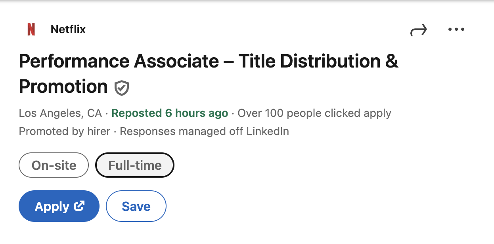
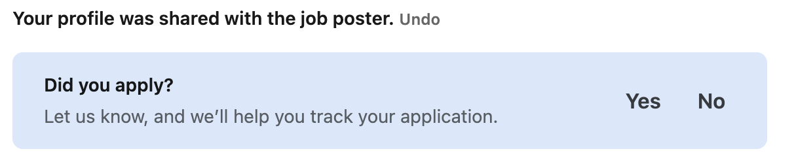
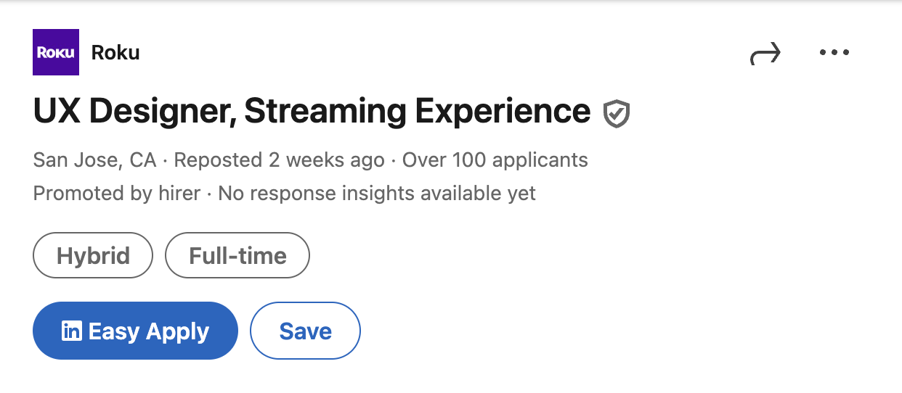

# Apply for a job

## Overview

Every LinkedIn job listing offers one of two ways to apply: external applications and Easy Apply. 

**External applications** typically direct you to a company's talent acquisition site or a SaaS platform such as Workday.

**Easy Apply** is LinkedIn's internal application submission system, allowing you to apply for a job with your LinkedIn profile (and without leaving the LinkedIn site) rather than creating an external candidate account.

## Apply using external applications

1. After [finding a job listing](../apply/search-for-jobs.md) whose description matches your preferences, click **Apply**. A new tab will be opened in your browser.

    

1. Complete the application according to the talent acquisition site's requirements.
1. (*Optional*) After completing the application, return to the LinkedIn posting and select **Yes** in the following prompt:

    

    By selecting **Yes**, you can track your application progress in LinkedIn from the job tracker. You can access applied jobs by returning to the Jobs landing page and clicking **Job tracker**.

## Apply with Easy Apply

1. Click **Easy Apply** under a job listing.

    

1. Fill in any required fields. These often include contact information, a CV, and a cover letter, but exact requirements vary by listing.
1. Click **Review** once you have completed the application to look over your responses.
1. Click **Submit application** to send your application to the recruiter.

With Easy Apply, your application is automatically added to the Job tracker.

## Related tasks

- [Search for jobs](../apply/search-for-jobs.md)
- [Track application progress](../apply/track-application.md)
- [Premium feature: Mark a job as your Top Choice](../premium/mark-job-as-top-choice.md)
- [Premium feature: View analytics for a job posting](../premium/view-analytics.md)
