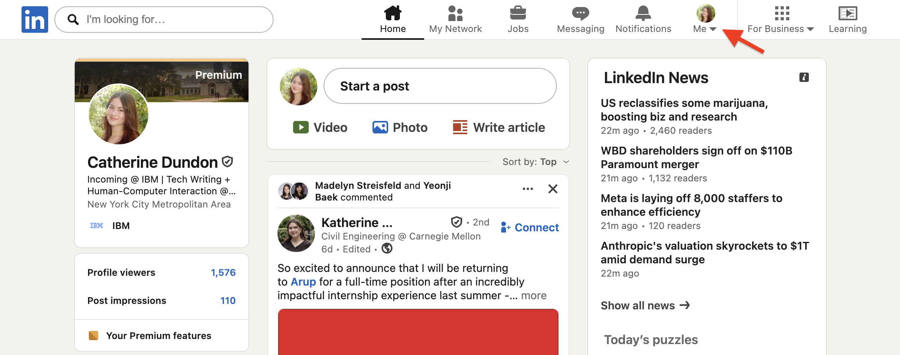
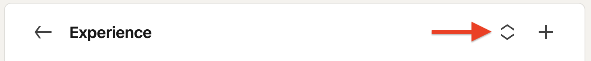
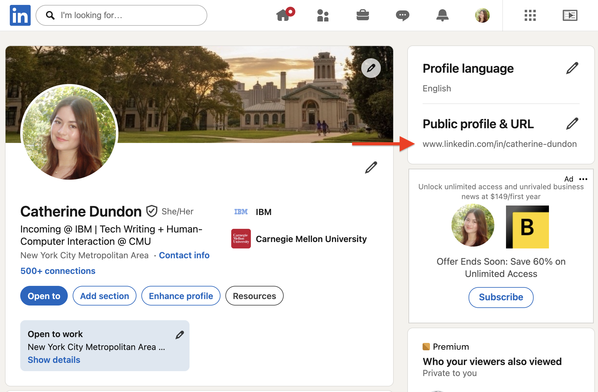
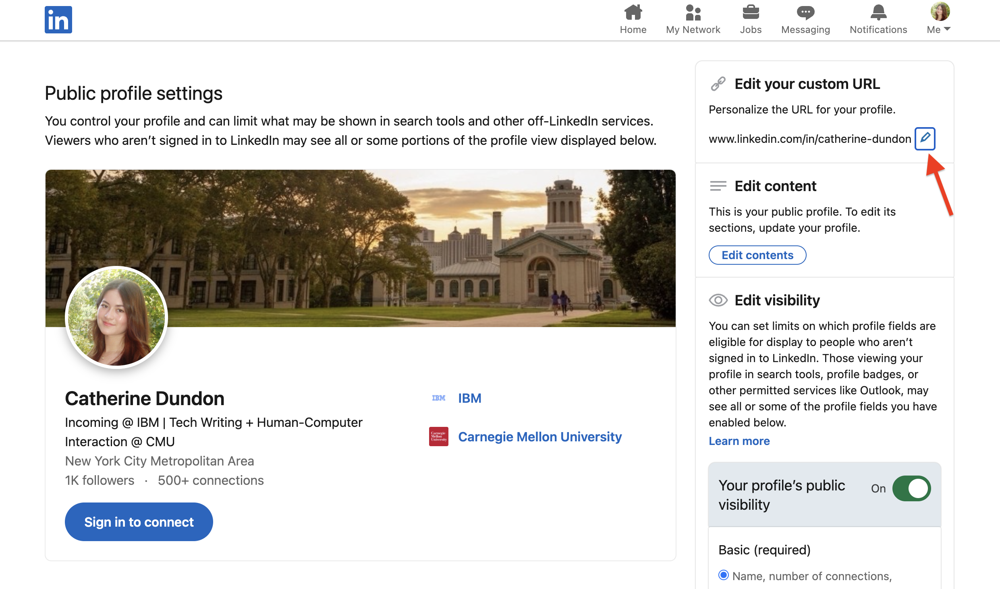

# Set up your profile

## Overview

A professional profile on LinkedIn acts as your digital CV. You can showcase your experiences, educations, skills, and more to impress recruiters and find the jobs are the best fits for you.

## Add an intro

A LinkedIn intro contains the first information that recruiters and other LinkedIn users will see when previewing or visiting your profile. 

Edit your intro by completing the following steps:

### 1. Access your profile

To access your profile, click your profile picture on the top right of the navigation bar. 

From the dropdown, select **View profile**.

### 2. Edit intro details

Click the pencil icon to the right of your profile picture to open the editing panel, then enter your info.

Although not all fields are required, filling out more information increases the reach of your professional profile. [Learn more about intro fields and their usage](../references/intro-fields.md).

Click **Save** after entering your info.

## Add experiences and other qualifications to your profile

1. On your profile page, scroll down to the [experience type](../references/intro-fields.md/#profile-sections) you want to update (for example, Experience, Education, or Skills).
1. Click the plus icon in that section.
1. Fill any required fields with your information.
1. Click **Save**.

!!! tip
    To reorder any entries in a section, click the pencil icon in that section, then click the reorder icon to the left of the plus icon.

    

    Reorder your entries in the popup, then exit to save.

## Share your profile

After polishing your profile, you can share it as a URL for recruiters and colleagues to access.

On your profile page, copy the link under **Public profile & URL**. Paste the link into your resume, online portfolio, or anywhere you want to promote your LinkedIn profile.

### Customize your profile's URL

You can customize your URL's slug (in other words, the end of the URL) to create a more readable or representative link to share with the public.

!!! example "URL customization example"
    === "Default"
        
        www.linkedin.com/in/mmorrison1810

    === "Customized"

        www.linkedin.com/in/margaret-morrison

Follow these steps to customize your URL slug:

1. Click the pencil icon next to **Public profile & URL** (see image above). A new tab opens in your browser.
1. Under **Edit your custom URL**, click the pencil icon. 
1. Enter a custom URL slug. The custom slug must contain 3-100 letters or numbers, and it cannot use spaces, symbols, or special characters.

## Related tasks

- [Add job preferences](../apply/add-job-preferences.md)
- [Premium feature: See who has viewed your profile](../premium/see-who-viewed-profile.md)

## Learn more

- [Reference: Intro fields and profile sections](../references/intro-fields.md)

