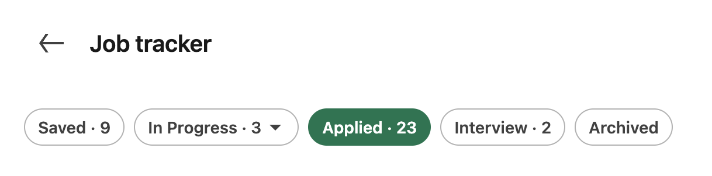
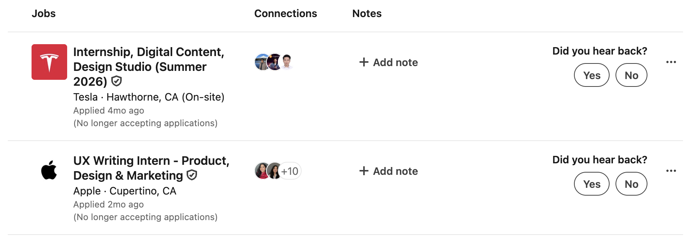

# Track application progress

## Overview

You can keep track of the jobs you applied to within the job tracker, which allows you to update application statuses and archive old job listings.

## View jobs you applied to

From the Jobs landing page, click **Job tracker**. Select a filter (Saved, In Progress, Applied, Interview, or Archived) to view your jobs.

## Update application status

For each job in the job tracker, you can simply respond to the prompts to update your status.
 

Alternatively, you can click the ellipsis icon (**...**) to quickly archive or change the stage of your application.

## Related tasks

- [Apply for a job](../apply/apply-for-jobs.md)