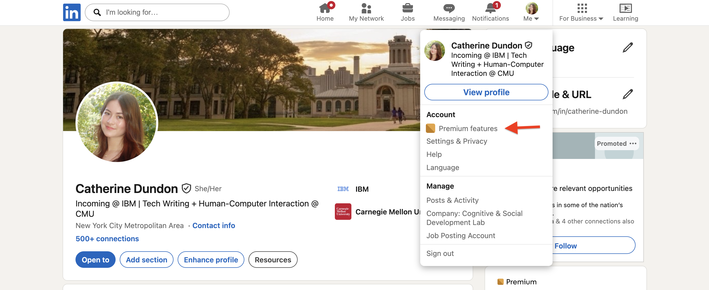
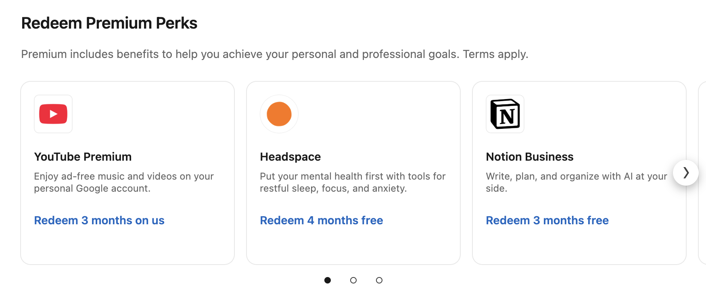

# Activate Premium Perks

## Overview

LinkedIn Premium subscribers are able to redeem Premium Perks, which include free trials to applications that help you achieve your personal and professional goals.

## Redeem Premium Perks

1. Click **Me** in the top navigation bar.
1. From the dropdown and under **Account**, select **Premium features*.

    

1. Scroll down to the **Redeem Premium Perks** section.

    

1. Select the perk you want to redeem.
1. Complete any required sign-up process to access your free trial for the selected application.

## Currently available applications

The following table details all applications and deals currently included in Premium Perks, as well as the length of their trials.

| App name | Description | Trial length |
| --- | --- | --- |
| YouTube Premium | Enjoy ad-free music and videos on your personal Google account. | 3 months |
| Headspace | Put your mental health first with tools for restful sleep, focus, and anxiety. | 4 months |
| Notion Business | Write, plan, and organize with AI at your side. | 3 months |
| NordVPN Basic | Browse with more privacy and security on every device. | 3 months |
| FoundersCard | Enjoy VIP travel benefits, special business discounts, and curated networking events. | 1 year |
| Oura | Take control of your health with personalized insights for your health goals. 10% off Oura Ring 4. | 1 month |
| LegalZoom | Register your business, protect your brand, stay compliant with legal tools, and more. Trusted by millions. 25% off services | One-time use |

## Learn more

- [Premium Perks - Quick Access](https://www.linkedin.com/premium/premium-perks/)