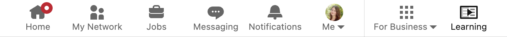
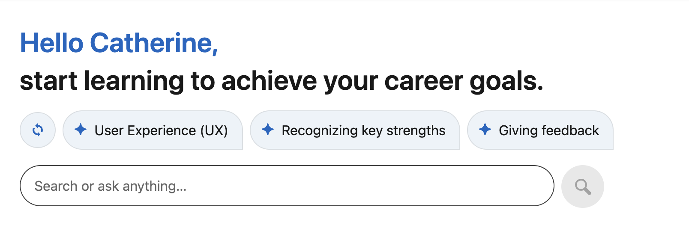
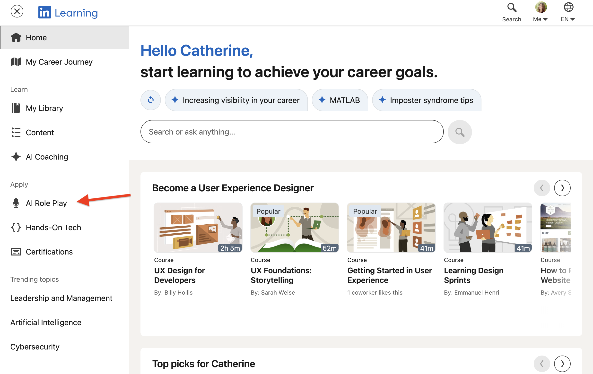
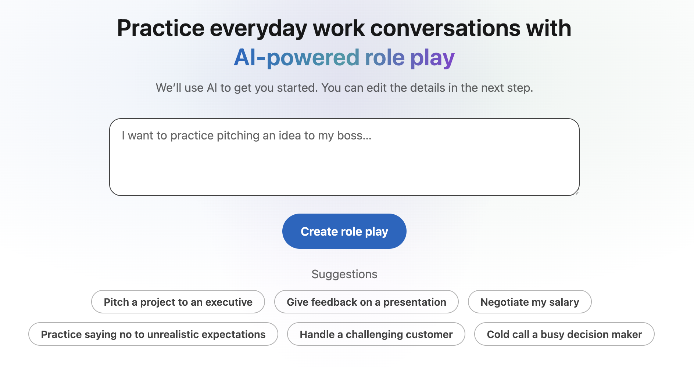
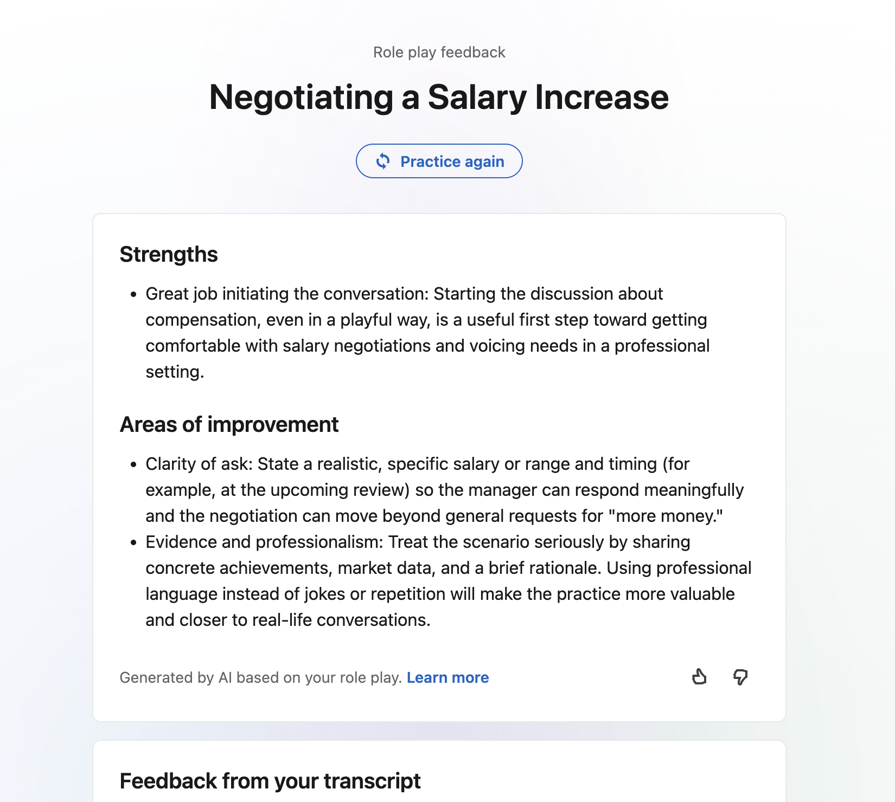

# Learn with LinkedIn Learning

## Overview

LinkedIn Learning provides support for professional development and certifications through AI coaching and online courses. You can used LinkedIn Learning to prepare for interviews, gain qualifications for jobs that interest you, and display certificates on your profile.

## Take online courses to develop career skills

1. To access LinkedIn Learning, click the **Learning** icon at the end of the top navigation bar.
    

    This will open the Learning Career Hub.

1. In the search bar, enter the role, skill, or industry you want to take a course on.

    

    The search will retrieve the courses that best fit your desired outcomes.

1. Select a course that aligns with your goals.

1. Complete all lectures, readings, and quizzes to earn a certificate for that course.

## Practice for interviews with AI-powered roleplay

AI-powered coaching allows your to role play work conversations or prepare for your next interview. Coaching can be completed through audio/speech features (microphone required) or typing.

1. From the Learning home page under the **Apply** section, select **AI Role Play**.

    

1. In the AI roleplay prompt, enter the scenario or conversation you want to practice. For example: "I want to practice negotiating a salary increase."

    

    After submitting your scenario, you will be presented with an overview of:

    - What the conversation will be about
    - What will make the conversation successful
    - Who the conversation is with (i.e., a short bio of your AI chat partner)

1. Click **Start** to begin your roleplay
    
    - (*Optional*) If you would like to make change to your scenario, click **Edit** to manually define the scenario's goals, success criteria, and the AI's personality.

1. Listen to your AI chat partner (captions available) and prepare a response. You can speak your response or type it into the chat.

1. Continue the back and forth conversation.

1. When the conversation reaches a natural conclusion, click **End session**. The personalized results page will offer feedback to help you close skill gaps.

    

## Learn more

- [LinkedIn Learning (External)](https://www.linkedin.com/learning/)