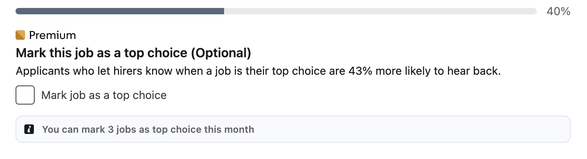

# Mark a job as your Top Choice

## Overview

While applying for a job with Easy Apply, Premium subscribers can mark the job as a Top Choice job. Top Choice job applications are more likely to stand out to hirers or recruiters.

!!! note
    
    You can only mark up to three jobs as top choice job in a month.

1. [Begin an application with Easy Apply](../apply/apply-for-jobs.md/#apply-with-easy-apply).
1. During the application process, from the **Mark this job as a top choice (Optional)** section, select the checkbox to **Mark job as a top choice**.

    

1. (*Optional*) Under **Include a message with your application**, you can type a statement describing why this job is a top choice.
1. Submit your job application once all other fields are complete.

After you submit your application, the job lister can see that you marked their listing as a Top Choice job.

## Related tasks

- [Apply for jobs](../apply/apply-for-jobs.md)