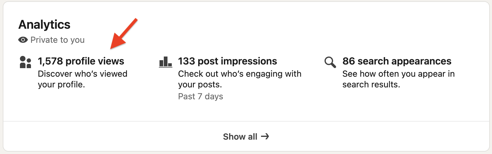
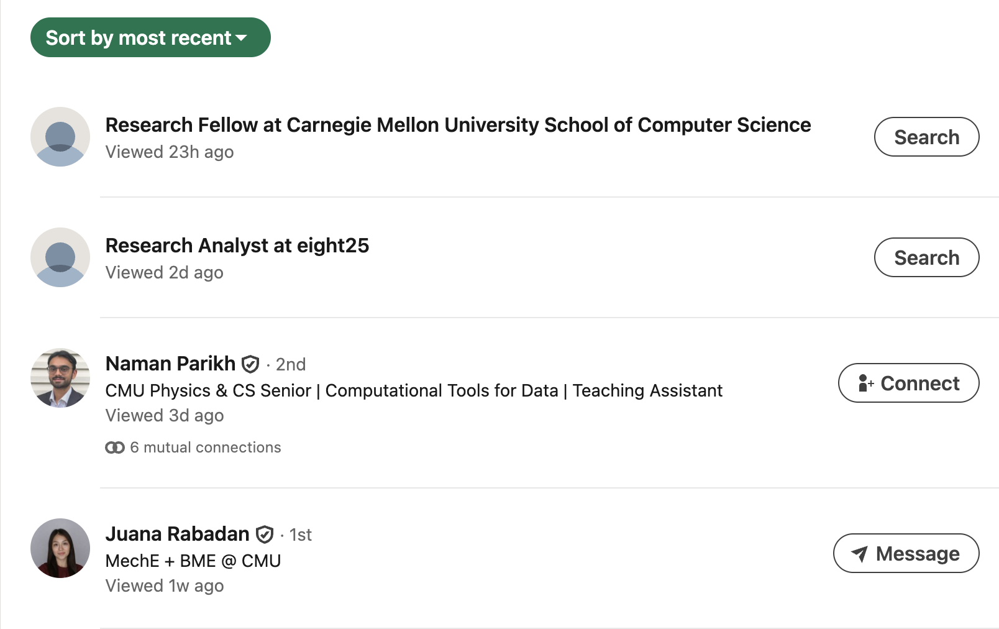

# See who has viewed your profile

## Overview

Premium users can see who has viewed their profile (up to 365 days of history) as well as profile view trends. Profile view trends can indicate how well your profile attracts recruiters for the roles that interest you.

1. On your profile page under the **Analytics** section, click **Discover who's viewed your profile**. This will open a new page.
    
    

1. Under **Who's viewed your profile**, select a filter to sort recent viewers by recency, company, location, and more.

    

## Related tasks

- [Set up your profile](../apply/set-up-your-profile.md)