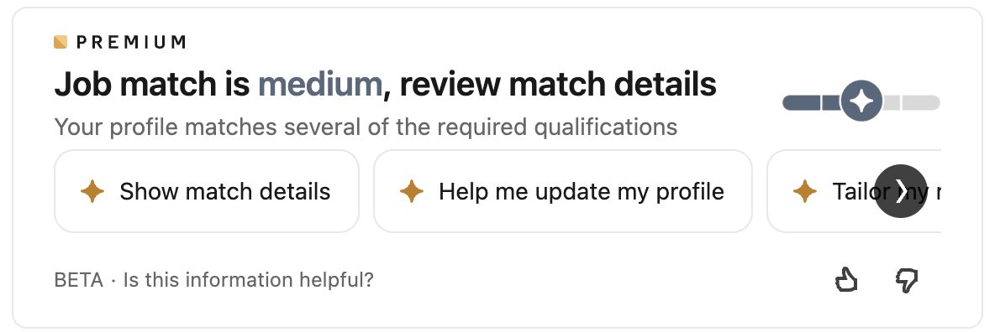
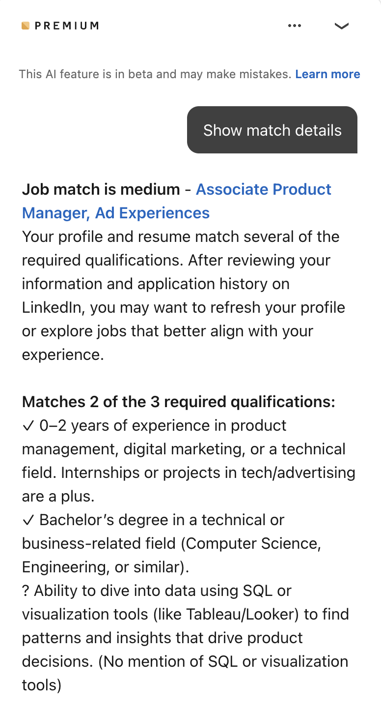
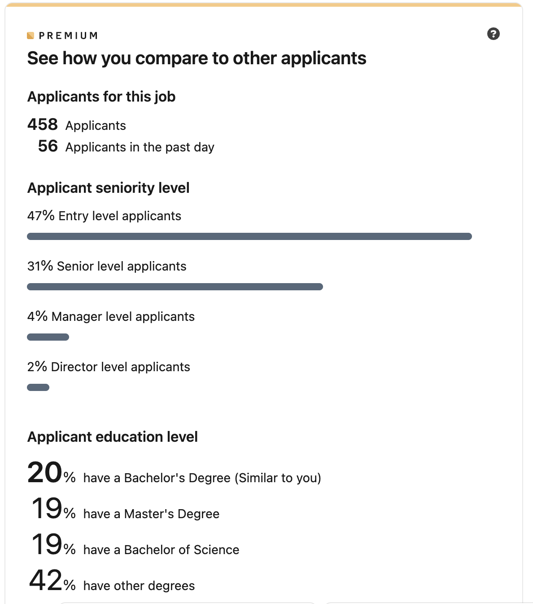
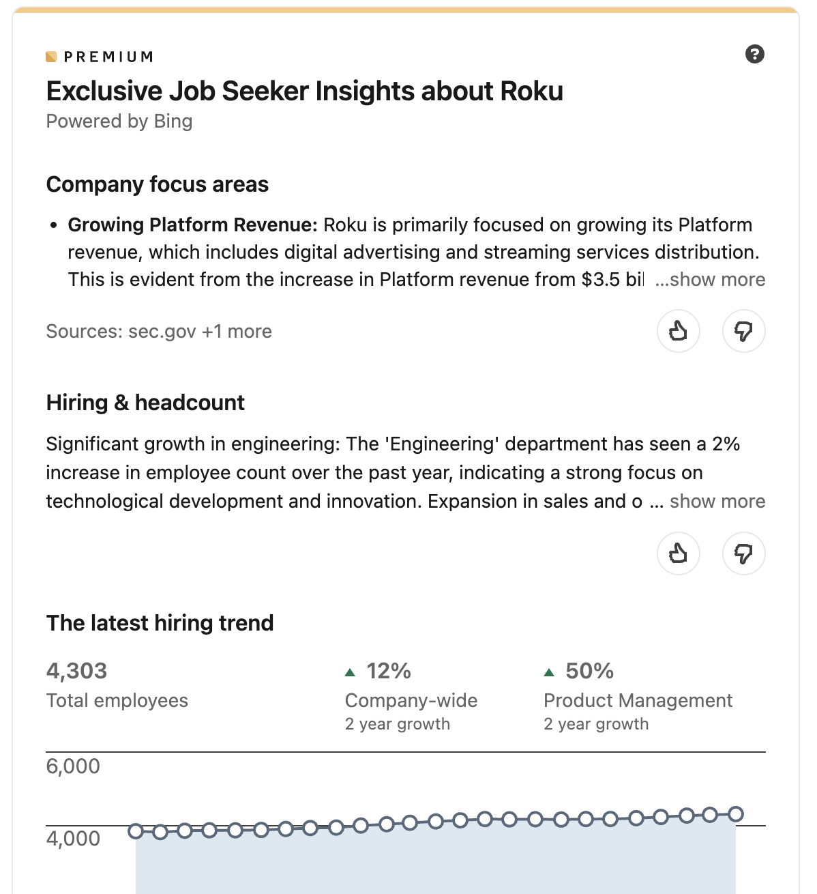

# View analytics for a job posting

## Assess job match level

You can use Premium to assess how well your profile's qualifications match with a job listing's requirements.

1. After [finding a job listing](../apply/search-for-jobs.md), scroll down to find the job match prompt:

    

1. Select an action to learn more about your match details. An AI-powered chat opens, detailing how your qualifications align with the job listing and providing further advice on interview preparation and expectations.

    

    You can continue to ask questions in the chat to learn more about the job match.

!!! info

    Job match details are based on the qualifications you have listed in your LinkedIn profile. If you think that your match analysis does not accurately reflect your qualifications, [try adding more experiences to your profile](../apply/set-up-your-profile.md).

## Compare yourself with other applicants

Scroll further down in the job listing to view data about other users who have applied for the job. This data includes total number of applicants, seniority, and education levels.

## View a company's hiring trends

Below applicant data, you can view summaries and visualizations of a company's hiring trends.

Interact with graphs and linked resources to learn more about any data point.

!!! note

    The analytics provided by Premium are based on LinkedIn user data. They do not account for external applications or recruiting patterns.

## Related tasks

- [Apply for jobs](../apply/apply-for-jobs.md)
- [Set up your profile](../apply/set-up-your-profile.md)

